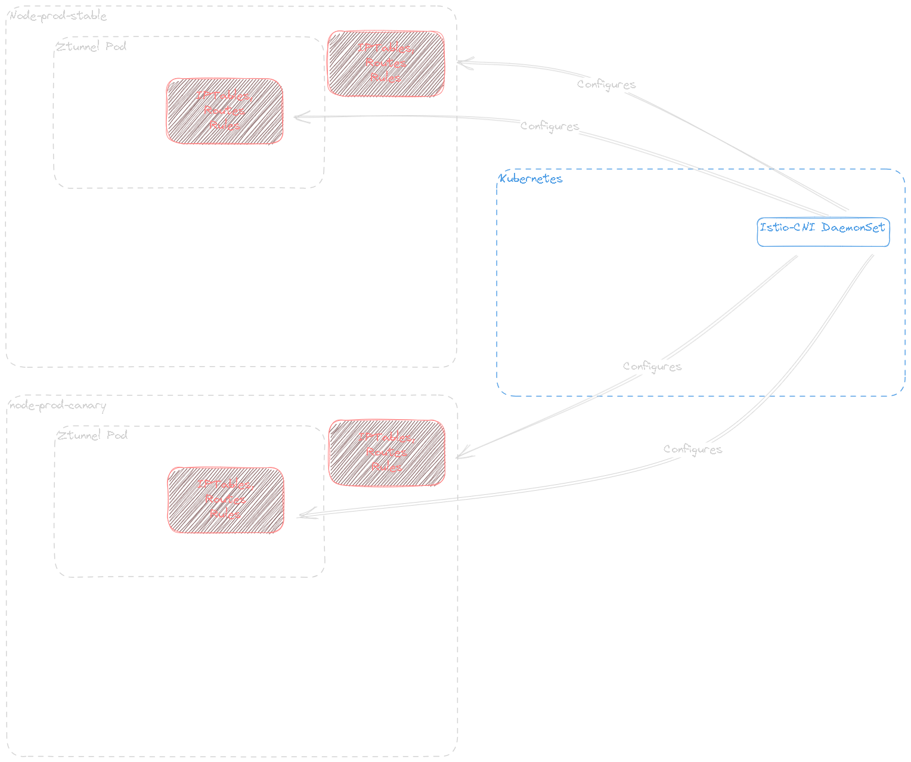
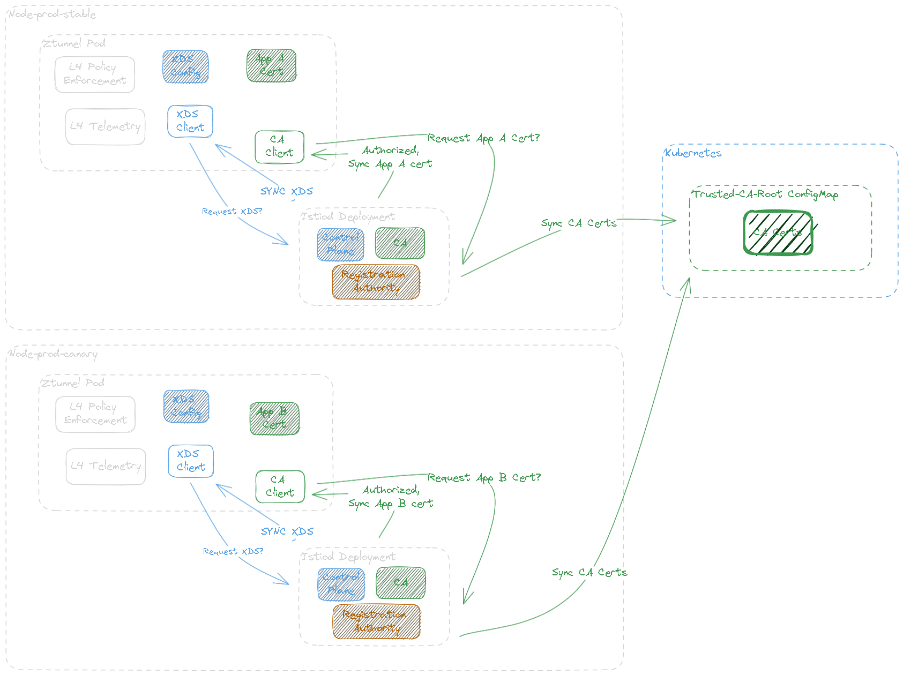
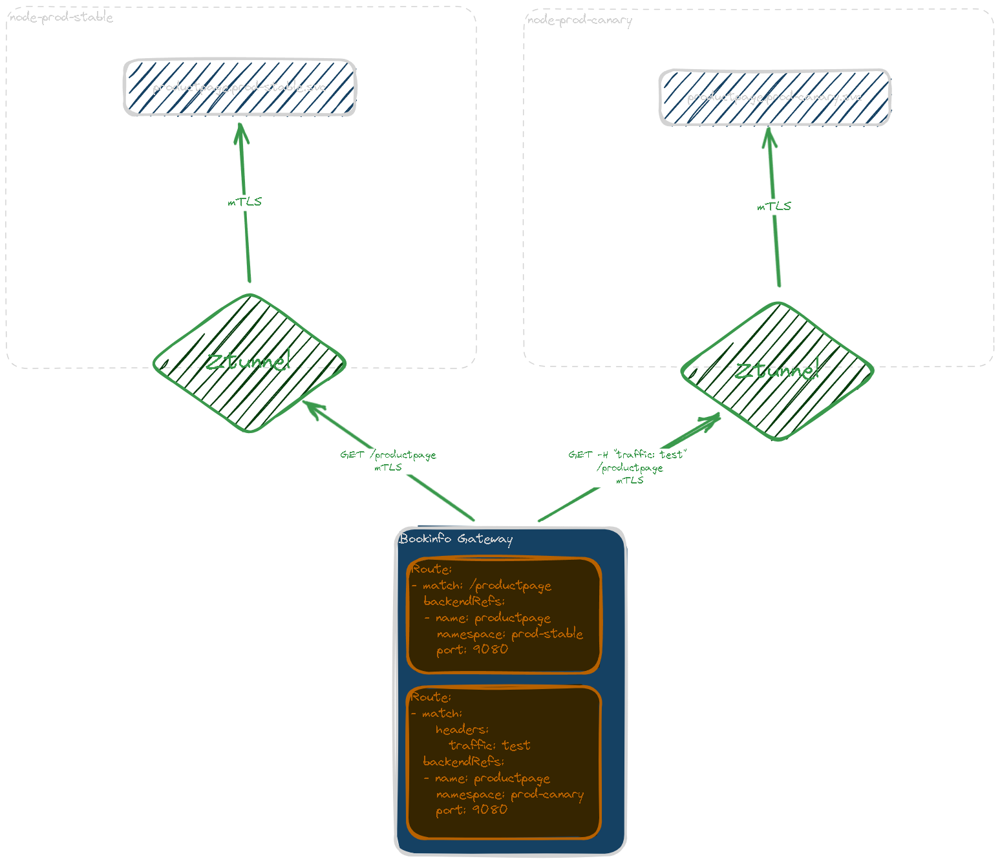

# Exploring Canary Upgrades with Istio Ambient Mesh

Ambient Mesh leverages eBPF to reduce resource usage of Istio's data plane components.  It eliminates the need for sidecar proxies because eBPF leverages the kernel network layer of worker nodes for mesh traffic management.  The goal of this guide is to answer the following:

1. What are the core components of Ambient Mesh?
1. Which components are scoped to the kernel network layer
1. Which components are scoped to the Kubernetes network layer?
1. How does a canary upgrade of the Istio control plane work with Ambient Mesh?

## Deploy Dependencies

1. Install docker and kubectl
    ```shell
    sudo snap install docker
    sudo snap install kubectl --classic
    ```
1. Install kind:
    ```shell
    [ $(uname -m) = x86_64 ] && curl -Lo ./kind https://kind.sigs.k8s.io/dl/v0.20.0/kind-linux-amd64
    chmod +x ./kind
    sudo mv ./kind /usr/local/bin/kind

    sudo kind create cluster --config=- <<EOF
    kind: Cluster
    apiVersion: kind.x-k8s.io/v1alpha4
    name: ambient
    networking:
      apiServerAddress: "10.0.0.152"
      apiServerPort: 6443
    nodes:
    - role: control-plane
    - role: worker
    - role: worker
    EOF
    ```
1. Generate kubeconfig:
    ```shell
    mkdir -p ~/.kube
    sudo kind get kubeconfig --name ambient > ~/.kube/config
    ```
1. Install MetalLB:
    ```shell
    kubectl apply -f https://raw.githubusercontent.com/metallb/metallb/v0.13.7/config/manifests/metallb-native.yaml

    # Determine Docker pod IPAM CIDR
    sudo docker network inspect -f '{{.IPAM.Config}}' kind

    # Add IP Address Pool
    kubectl apply -f <<EOF
    apiVersion: metallb.io/v1beta1
    kind: IPAddressPool
    metadata:
      name: example
      namespace: metallb-system
    spec:
      addresses:
      - 172.18.255.200-172.18.255.250
    ---
    apiVersion: metallb.io/v1beta1
    kind: L2Advertisement
    metadata:
      name: empty
      namespace: metallb-system
    EOF
    ```
1. Add Kubernetes Gateway API CRDs
    ```shell
    kubectl get crd gateways.gateway.networking.k8s.io &> /dev/null \
      ||   { kubectl kustomize "github.com/kubernetes-sigs/gateway-api/config/crd/experimental?ref=v0.6.1" \
      | kubectl apply -f -; }
    ```
!!! note "OPTIONAL: Test MetalLB Functionality Before beginning"
    Before you run into issues with communicating with bookinfo through its gateway, make sure that metallb is accessible and working before you begin.  Kind provides [easy documentation](https://kind.sigs.k8s.io/docs/user/loadbalancer/) to do so.


## Understanding Ambient Mesh's Core Components

Deploy Ambient Mesh following the [Istio Ambient Mesh Getting Started Guide](https://istio.io/latest/docs/ops/ambient/getting-started/):


### Identify Ambient Mesh's Core Components

Deploy Istio using `istioctl` and we should see exactly what components are being deployed:

```shell
# Install istioctl
wget https://github.com/istio/istio/releases/download/1.18.0-alpha.0/istio-1.18.0-alpha.0-linux-amd64.tar.gz
tar xzf istio-1.18.0-alpha.0-linux-amd64.tar.gz
sudo cp istio-1.18.0-alpha.0/bin/istioctl /usr/local/bin/istioctl
pushd istio-1.18.0-alpha.0

# Install Istio
istioctl install --set profile=ambient --skip-confirmation
```
```
✔ Istio core installed
✔ Istiod installed
✔ CNI installed
✔ Ingress gateways installed
✔ Ztunnel installed
✔ Installation complete
```

The `ambient` profile's `IstioOperator` configuration can be found in `manifests/profiles/ambient.yaml` within the Istio release archive.  This deploys `istio-cni`, `istio-core` (Base CRDs), `istiod` (control plane), and `ztunnel` (data plane) by default.  These component installations must be managed separately for a production-like release process.

We can see the following is installed:

1. Istio-CNI - `DaemonSet` chained CNI
1. Istio Core - CRDs
1. Istiod - `Deployment` control plane
1. Ztunnel - `DaemonSet` node-level mesh

According to the [Istio-CNI documentation regarding Canary Upgrades](https://istio.io/latest/docs/setup/additional-setup/cni/#upgrade), Istio-CNI's `DaemonSet` is scoped to the Kubernetes cluster level, and should not deploy as a canary release.

Ztunnel acts as a node-level mesh manager for Istio.  Since there is not much in the way of documentation for Ztunnel at the time of this writing, we must rely on Ztunnel's logs and the source code to understand its network scope.  Looking at Ztunnel's logs reveals its live configuration:

```yaml linenums="1" hl_lines="12 14"
connection_window_size: 4194304
frame_size: 1048576
socks5_addr: 127.0.0.1:15080
admin_addr: 127.0.0.1:15000
stats_addr: '[::]:15020'
readiness_addr: '[::]:15021'
inbound_addr: '[::]:15008'
inbound_plaintext_addr: '[::]:15006'
outbound_addr: '[::]:15001'
local_node: ambient-worker2
local_ip: 10.244.1.40
ca_address: https://istiod.istio-system.svc:15012
ca_root_cert: !File ./var/run/secrets/istio/root-cert.pem
xds_address: https://istiod.istio-system.svc:15012
xds_root_cert: !File ./var/run/secrets/istio/root-cert.pem
xds_on_demand: false
fake_ca: false
termination_grace_period:
secs: 5
nanos: 0
proxy_metadata:
ISTIO_VERSION: 1.18.0-alpha.0
num_worker_threads: 2
enable_original_source: null
proxy_args: proxy ztunnel
```

We can see that Ztunnel expects to get CA and XDS information from `https://istiod.istio-system.svc/15012`.  From this, we can update our prior assumptions:

1. Ztunnel is designed to receive network information from a single `istiod` service address
1. Revisioned Istio releases suffix the `istiod` control plane with the values of the `revision` attribute provided
1. Therefore, Ztunnel expects to connect to a single revision of the control plane, and should be revisioned as well

## Understanding Component Scope

We can draw the following conclusions:

1. Istio-CNI is designed as a cluster singleton that can manage network information for multiple revisioned control planes:
   
1. Istiod is scoped to the Kubernetes layer and manages the configuration of a single mesh.  Even though multiple Istiod revisions can be a part of the same control plane, their XDS configurations should be treated as separate; they only share trusted root CA configurations.  Additionally, Ztunnel is scoped to the node network layer but relies on a single revisioned control plane, so it must also be revisioned.  This means that it should not deploy to all nodes, but select a specific node with a matching revision label.
    
1. Finally, Bookinfo Gateway can split traffic between bookinfo-prod-stable and bookinfo-prod-canary in a canary deployment:
   

## Deploy Stable Ambient Mesh Revision

1. Label a single node so that it can schedule the current revision of Istio components
    ```shell
    kubectl label node ambient-worker istio.io/rev: 1-18-0-alpha-0
    ```
1. Install `istio-cni`
    ```shell
    istioctl install -f istio-cni.yaml
    ```
1. Install `istiod` and `ztunnel`
    ```shell
    istioctl install -f 1-18-0-alpha-0/control-plane.yaml
    istioctl install -f 1-18-0-alpha-0/data-plane.yaml
    ```
1. Next, deploy the workloads.  They must live on the `ambient-worker` node to be a part of the mesh, so each service gets a `nodeSelector` configuration:
    ```shell
    kubectl apply -f 1-18-0-alpha-0/bookinfo.yaml -n bookinfo-1-18-0-alpha-0
    kubectl apply -f 1-18-0-alpha-0/sleep.yaml -n bookinfo-1-18-0-alpha-0
    kubectl apply -f 1-18-0-alpha-0/notsleep.yaml -n bookinfo-1-18-0-alpha-0
    ```
1. Deploy the Bookinfo Gateway
    ```shell
    sed -e 's/from: Same/from: All/'      -e '/^  name: bookinfo-gateway/a\
      namespace: istio-system\
    '     -e '/^  - name: bookinfo-gateway/a\
        namespace: istio-system\
    ' samples/bookinfo/gateway-api/bookinfo-gateway.yaml | kubectl apply -f -
    ```
1. Send a request to productpage to make sure it works:
```shell
curl -s "http://172.18.255.202/productpage" | grep -o "<title>.*</title>"
```
1. Label the namespace to add the workloads to Ambient Mesh
    ```shell
    kubectl label namespace bookinfo-1-18-0-alpha-0 istio.io/dataplane-mode=ambient
    ```
1. Send a request to Product Page through Ambient:
    ```shell
    curl -s "http://172.18.255.202/productpage" | grep -o "<title>.*</title>"
    ```

Great!  It's all working.  Next, let's configure the next release.

## Deploy Canary Ambient Mesh Revision

1. Clone the project [repository](https://github.com/jonathanelbailey/ambient-mesh-canary-demo.git). 

1. Label Node with Canary Revision
    ```shell
    kubectl label node ambient-worker2 istio.io/rev: 1-18-1
    ```
1. Deploy the Istio components:
    ```shell
    istioctl install -f 1-18-1/control-plane.yaml
    istioctl install -f 1-18-1/data-plane.yaml
    ```
1. Deploy Canary Workloads
    ```shell
    # create new ns for bookinfo
    kubectl create ns bookinfo-1-18-1

    kubectl apply -f 1-18-1/bookinfo.yaml -n bookinfo-1-18-1
    kubectl apply -f 1-18-1/sleep.yaml -n bookinfo-1-18-1
    kubectl apply -f 1-18-1/notsleep.yaml -n bookinfo-1-18-1

    # label namespace
    kubectl label namespace bookinfo-1-18-1 istio.io/dataplane-mode=ambient
    ```

## Prepare Bookinfo Gateway for Canary

Configure the `HTTPRoute` to match the `traffic=test` header, and route it to the canary workloads:

```yaml linenums="1" hl_lines="30-37" title="bookinfo-httproute.yaml"
apiVersion: gateway.networking.k8s.io/v1beta1
kind: HTTPRoute
metadata:
  name: bookinfo
spec:
  parentRefs:
  - name: bookinfo-gateway
    namespace: istio-system
  rules:
  - matches:
    - path:
        type: Exact
        value: /productpage
    - path:
        type: PathPrefix
        value: /static
    - path:
        type: Exact
        value: /login
    - path:
        type: Exact
        value: /logout
    - path:
        type: PathPrefix
        value: /api/v1/products
    backendRefs:
    - name: productpage
      namespace: bookinfo-1-18-0-alpha-0
      port: 9080
  - matches:                                # Add route for canary traffic (1)
    - headers:
      - name: traffic
        value: test
    backendRefs:
    - name: productpage
      namespace: bookinfo-1-18-1
      port: 9080
```

1. To canary the release, add a route that matches on the header `traffic: test`, which will be used when cURLing the canary workloads later on.  Be sure to include the namespaces of each release.

## Canary Deployment

1. Update Routes
    ```shell
    kubectl apply -f bookinfo-httproute.yaml
    ```
    Now Bookinfo is ready to take canary traffic.
1. Test canary traffic
  ```shell
  curl -s -H "traffic: test" "http://172.18.255.202/productpage" | grep -o "<title>.*</title>"
  ```
    You should see the traffic come back as expected.  Now it's time to shift traffic over to the new release.

## Blue-Green Deployment

Update the `HttpRoute` with the following:

```yaml linenums="1" hl_lines="27-34" title="bookinfo-httproute.yaml"
apiVersion: gateway.networking.k8s.io/v1beta1
kind: HTTPRoute
metadata:
  name: bookinfo
spec:
  parentRefs:
  - name: bookinfo-gateway
    namespace: istio-system
  rules:
  - matches:
    - path:
        type: Exact
        value: /productpage
    - path:
        type: PathPrefix
        value: /static
    - path:
        type: Exact
        value: /login
    - path:
        type: Exact
        value: /logout
    - path:
        type: PathPrefix
        value: /api/v1/products
    backendRefs:
    - name: productpage
      namespace: default
      port: 9080
      weight: 90
    - name: productpage
      namespace: bookinfo-1-18-1
      port: 9080
      weight: 10                  # Set canary weight to 10% of traffic (1)
```

1. This should be done multiple times while running load.  An arbitrary example would be 10%, 50%, then 100% of traffic to the canary release.

Then begin shifting traffic:

1. Shift traffic to the canary:
    ```shell
    kubectl apply -f bookinfo-httproute.yaml

    # test
    curl -s "http://172.18.255.202/productpage" | grep -o "<title>.*</title>"
    ```
1. Once the blue-green deployment is complete, the `1-18-0-alpha-0` resources should be ready to clean up:
    ```shell
    # remove bookinfo
    kubectl delete -f 1-18-0-alpha-0/bookinfo.yaml
    kubectl delete -f 1-18-0-alpha-0/sleep.yaml
    kubectl delete -f 1-18-0-alpha-0/notsleep.yaml

    # unlabel default ns
    kubectl label ns default istio.io/dataplane-mode-

    # uninstall istio
    istioctl uninstall --purge
    ```

## Conclusion

Canary Upgrades for Ambient Mesh differ wildly from vanilla Istio.  Managing canaries at the node level provide some unforseen challenges, but also provides an opportunity to better organize kubernetes workloads along the physical constraints of each node.  This may not provide the flexibility that some are used to with kubernetes, but workloads should take locality into account for optimal performance anyway.