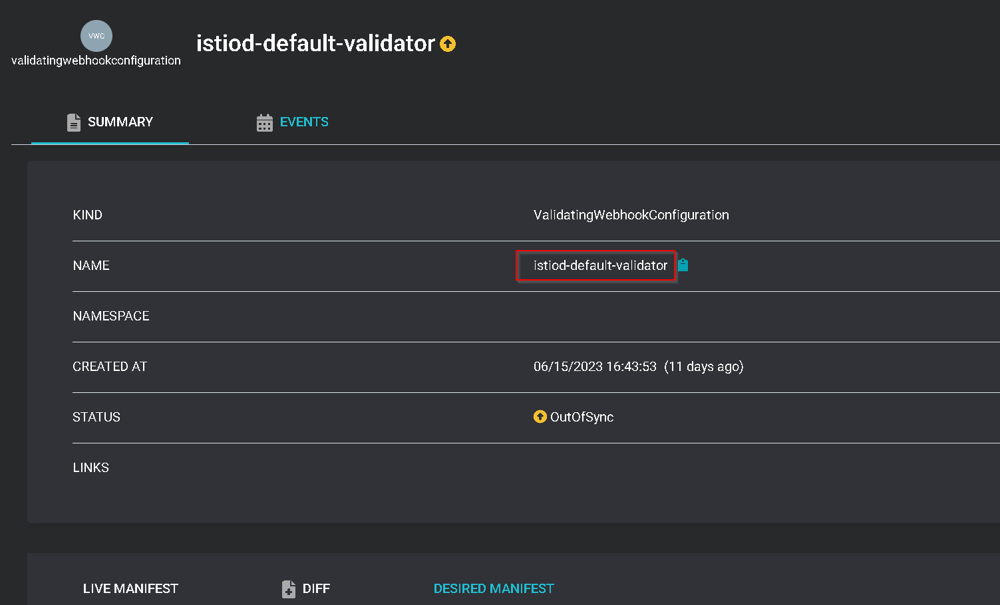
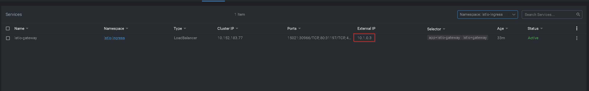
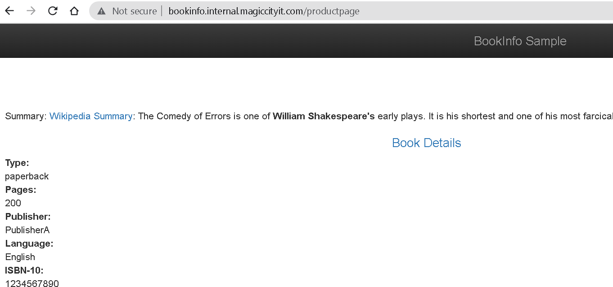
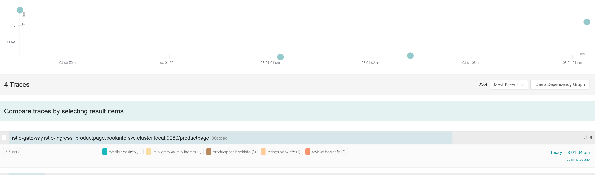

# GitOps with Istio and ArgoCD

## Problem Definition

Managing Istio can be tough.  Some years ago Istio 1.4.x was deployable via Helm, but was hard to manage desired state because of the massive microservice sprawl.  Later on, Istio packaged the control plane services into a single `istiod` instance, and even provided support for Operator style deployments and an easy to use cli tool called `istioctl`.  As of the time of this writing, Istio has deprecated Operator based deployments due to issues with webhook configurations that improperly register with the control plane.

## Prerequisites

* Kubernetes
* ArgoCD

## Clone the Project Repository

Clone the [project](https://github.com/jonathanelbailey/homelab.catalog):

```shell
git clone https://github.com/jonathanelbailey/homelab.catalog.git
cd homelab.catalog/istio-gitops/
```

## Deploy Istio Base Application Resource

The following `Application` manifest will deploy the Istio base helm chart:

```yaml title="applications/istio-base/istio-base.yaml" linenums="1"
apiVersion: argoproj.io/v1alpha1
kind: Application
metadata:
  name: istio-base
  namespace: argocd
spec:
  destination:
    namespace: istio-system
    server: https://kubernetes.default.svc
  project: default
  source:
    chart: base
    repoURL: https://istio-release.storage.googleapis.com/charts
    targetRevision: 1.16.5
  syncPolicy:
    automated:
      prune: true
      selfHeal: true
    retry:
      backoff:
        duration: 5s
        factor: 2
        maxDuration: 3m0s
      limit: 2
    syncOptions:
      - CreateNamespace=true
```

Apply it with `kubectl`:

```shell
kubectl apply -f applications/istio-base/istio-base.yaml
```

## Deploy Istiod Application Resource

and here is the `application` manifest for deploying `istiod`:

```yaml title="applications/istiod/istiod.yaml" linenums="1"
apiVersion: argoproj.io/v1alpha1
kind: Application
metadata:
  name: istio-base
  namespace: argocd
spec:
  destination:
    namespace: istio-system
    server: https://kubernetes.default.svc
  project: default
  source:
    chart: istiod
    repoURL: https://istio-release.storage.googleapis.com/charts
    targetRevision: 1.16.5
  syncPolicy:
    automated:
      prune: true
      selfHeal: true
    retry:
      backoff:
        duration: 5s
        factor: 2
        maxDuration: 3m0s
      limit: 2
    syncOptions:
      - CreateNamespace=true
```

Apply it with `kubectl`:

```shell
kubectl apply -f applications/istiod/istiod.yaml
```

If you check the sync status of `istio-base` you will notice that it is no longer synced:


To fix this issue, we'll need to tell ArgoCD to ignore updates to `istio-base` by `istiod`:

```yaml title="applications/istio-base/istio-base.yaml" linenums="1" hl_lines="28 30-34"
apiVersion: argoproj.io/v1alpha1
kind: Application
metadata:
  name: istio-base
  namespace: argocd
spec:
  destination:
    namespace: istio-system
    server: https://kubernetes.default.svc
  project: default
  source:
    chart: base
    repoURL: https://istio-release.storage.googleapis.com/charts
    targetRevision: 1.16.5
  syncPolicy:
    automated:
      prune: true
      selfHeal: true
    retry:
      backoff:
        duration: 5s
        factor: 2
        maxDuration: 3m0s
      limit: 2
    syncOptions:
      - CreateNamespace=true
      # Set sync options to respect differences in managed fields
      - RespectIgnoreDifferences=true
  # IGNORE CHANGES MADE BY PILOT-DISCOVERY
  ignoreDifferences:
    - group: '*'
      kind: '*'
      managedFieldsManagers:
        - pilot-discovery
```

And apply the updated manifest:

```shell
kubectl apply -f applications/istio-base/istio-base.yaml
```

When ArgoCD resyncs this change, `istio-base` should be fully synced and healthy.

## Deploy Istio Gateway Application Resource

Next, we'll deploy an Istio Gateway using the following manifest:

```yaml title="applications/istio-gateway/istio-gateway.yaml" linenums="1"
apiVersion: argoproj.io/v1alpha1
kind: Application
metadata:
  name: istio-base
  namespace: argocd
spec:
  destination:
    # deploy to a different namespace than istiod
    namespace: istio-ingress
    server: https://kubernetes.default.svc
  project: default
  source:
    chart: gateway
    repoURL: https://istio-release.storage.googleapis.com/charts
    targetRevision: 1.16.5
  syncPolicy:
    automated:
      prune: true
      selfHeal: true
    retry:
      backoff:
        duration: 5s
        factor: 2
        maxDuration: 3m0s
      limit: 2
    syncOptions:
      - CreateNamespace=true
```

And apply the manifest:

```shell
kubectl apply -f applications/istio-gateway/istio-gateway.yaml
```

Once ArgoCD fully syncs, an `istio-gateway` instance will be deployed with a Service of `type: LoadBalancer`:



## Validating the Installation

Deploy the bookinfo applications:

```shell
kubectl create ns bookinfo
kubectl label ns bookinfo istio-injection=enabled
kubectl apply -f https://raw.githubusercontent.com/istio/istio/release-1.18/samples/bookinfo/networking/bookinfo-gateway.yaml -n bookinfo
```

The `gateway` and `virtualservice` configurations are a bit different than the default:

```yaml title="services/bookinfo/bookinfo-gateway.yaml" linenums="1" hl_lines="15 24"
apiVersion: networking.istio.io/v1alpha3
kind: Gateway
metadata:
  name: bookinfo-gateway
spec:
  selector:
    istio: gateway # reflects the new gateway deployment label
  servers:
  - port:
      number: 80
      name: http
      protocol: HTTP
    hosts:
    # Define your host, and make sure the FQDN resolves to the Istio Gateway's external IP 
    - "bookinfo.internal.magiccityit.com"
---
apiVersion: networking.istio.io/v1alpha3
kind: VirtualService
metadata:
  name: bookinfo
spec:
  hosts:
  # Define your host, and make sure the FQDN resolves to the Istio Gateway's external IP 
  - "bookinfo.internal.magiccityit.com"
  gateways:
  - bookinfo-gateway
  http:
  - match:
    - uri:
        exact: /productpage
    - uri:
        prefix: /static
    - uri:
        exact: /login
    - uri:
        exact: /logout
    - uri:
        prefix: /api/v1/products
    route:
    - destination:
        host: productpage
        port:
          number: 9080
```

Apply the manifest:

```shell
kubectl apply -f services/bookinfo/bookinfo-gateway.yaml -n bookinfo
```

Check that bookinfo works by accessing `http://bookinfo.internal.magiccityit.com/productpage`:



The gateway can also be updated to use TLS by configuring port 443 with an appropriate valid certificate:

```yaml title="services/bookinfo/bookinfo-gateway.yaml" linenums="1" hl_lines="16-24"
apiVersion: networking.istio.io/v1alpha3
kind: Gateway
metadata:
  name: bookinfo-gateway
spec:
  selector:
    istio: gateway # reflects the new gateway deployment label
  servers:
  - port:
      number: 80
      name: http
      protocol: HTTP
    hosts:
    # Define your host, and make sure the FQDN resolves to the Istio Gateway's external IP 
    - "bookinfo.internal.magiccityit.com"
  - port:
      number: 443
      name: https
      protocol: HTTPS
    hosts:
    - "bookinfo.internal.magiccityit.com"
    tls:
      mode: SIMPLE
      credentialName: internal-magiccityit-domain-tls
```

And finally apply the manifest:

```shell
kubectl apply -f services/bookinfo/bookinfo-gateway.yaml -n bookinfo
```

As long as the cert secret is available in the same namespace as `istio-gateway`, enabling TLS should be painless:


## Customizing Istio

If you need to customize Istio, you can add a second source that points to the Helm values file that you would like to use.  For example, let's customize `istiod` using the following values file:

```yaml title="services/istiod/values.yaml" linenums="1"
revision: "1-16-5"
revisionTags: ["stable"]

meshConfig:
  enablePrometheusMerge: true
  accessLogFile: /dev/stdout
  accessLogFormat: |
    [%START_TIME%] "%REQ(:METHOD)% %REQ(X-ENVOY-ORIGINAL-PATH?:PATH)% %PROTOCOL%" %RESPONSE_CODE% %RESPONSE_FLAGS% %RESPONSE_CODE_DETAILS% %CONNECTION_TERMINATION_DETAILS% "%UPSTREAM_TRANSPORT_FAILURE_REASON%" %BYTES_RECEIVED% %BYTES_SENT% %DURATION% %RESP(X-ENVOY-UPSTREAM-SERVICE-TIME)% "%REQ(X-FORWARDED-FOR)%" "%REQ(USER-AGENT)%" "%REQ(X-REQUEST-ID)%" "%REQ(:AUTHORITY)%" "%UPSTREAM_HOST%" %UPSTREAM_CLUSTER% %UPSTREAM_LOCAL_ADDRESS% %DOWNSTREAM_LOCAL_ADDRESS% %DOWNSTREAM_REMOTE_ADDRESS% %REQUESTED_SERVER_NAME% %ROUTE_NAME% traceID=%REQ(x-b3-traceid)%
  enableTracing: true
  defaultConfig:
    tracing:
      sampling: 100
      max_path_tag_length: 99999
      zipkin:
        address: jaeger-tracing-collector.monitoring.svc:9411

base:
  enableIstioConfigCRDs: false
  validateGateway: false
```

For ArgoCD to resync istiod with this configuration, we must add a second source:

```yaml title="applications/istiod/istiod.yaml" linenums="1" hl_lines="12-24"
apiVersion: argoproj.io/v1alpha1
kind: Application
metadata:
  name: istiod
  namespace: argocd
spec:
  destination:
    namespace: istio-system
    server: https://kubernetes.default.svc
  project: default
  # ADD SECOND SOURCE
  sources:
      # Point to catalog repository
    - repoURL: 'git@github.com:jonathanelbailey/homelab.catalog.git'
      # Define $values variable
      ref: values
      targetRevision: HEAD
    - chart: istiod
      repoURL: https://istio-release.storage.googleapis.com/charts
      targetRevision: 1.16.5
      # Use istiod values file from your own repository
      helm:
        valueFiles:
          - $values/istio-gitops/services/istiod/values.yaml
  syncPolicy:
    automated:
      prune: true
      selfHeal: true
    retry:
      backoff:
        duration: 5s
        factor: 2
        maxDuration: 3m0s
      limit: 2
    syncOptions:
      - CreateNamespace=true
```

This change, among other things, enables Envoy access logs and Jaeger tracing.  If you attempt to validate this change, you'll notice that there are no traces available.  Run the following to ensure that everything is updated:

```shell
kubectl label ns bookinfo istio.io/rev=stable
kubectl label ns istio-ingress istio.io/rev=stable
kubectl label ns bookinfo istio-injection-
kubectl label ns istio-ingress istio-injection-
kubectl rollout restart deployment -n bookinfo
kubectl rollout restart deployment -n istio-ingress
```

Now you can curl `https://bookinfo.internal.magiccityit.com/productpage`, and the trace can finally be seen in Jaeger:

