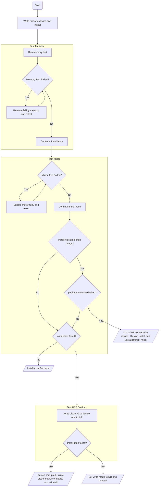

# Ubuntu Server Homelab Configuration Guide

## Choosing a Release

Ideally, choosing the latest LTS release will provide the most stable installation.  *.10 releases typically have edge band features that may not be available 
in *.04 releases, but aren't supported by many desirable projects like microk8s, kubeflow, etc.

!!! note "Guide Assumptions"
    * This guide details installation steps based on the Ubuntu 22.04 release.
    * This guide assumes that default configuration steps that require no change can be skipped.  Only the steps that require an update are listed.
    * The network configuration assumes the hardware has 4 physical ethernet interfaces that are connected to the network.
    * The Disk configuration assumes a RAID 5 array of 240GB SSDs with a hot spare.  The volume is ~450GB of available space.

Once you have downloaded the desired release, follow [this guide](https://ubuntu.com/tutorials/create-a-usb-stick-on-windows#3-usb-selection) to write the image
using Rufus.

## Installation Options

### Update Installation Image

You will first be prompted to choose whether to download the latest installation image.  If you run into issues installing Ubuntu, choose no.  Otherwise, choose yes.
Ubuntu will download and reload the image.

### Network Configuration

There are a number of network configuration scenarios:

#### Microk8s Single Node

1. Create a bond.  The bond name can remain the default `bond0`.
1. Set the bond mode to round robin.
1. Select all interfaces to be bonded.
1. Configure the bond's IPv4 stack to use DHCP.  *Optional: You can also configure IPv6 to use DHCP as well.*
1. Wait for the bond to receive its IP configuration, then select `Done`.

#### Openstack Hypervisor

1. Create a bond.  This will be the interface that the Microk8s cluster will be available from.  rename the bond from `bond0` to `cluster0`
1. set the bond mode to round robin.
1. Select the first two interfaces to be bonded.
1. Configure the bond's IPv4 stack to use DHCP.  *Optional: You can also configure IPv6 to use DHCP as well.*
1. Create another bond.  This will be the interface that the Metallb CIDR will be accessible from.  rename the bond from `bond0` to `loadbalancer0`
1. Configure the bond's IPv4 stack to use DHCP.  *Optional: You can also configure IPv6 to use DHCP as well.*
1. Wait for the bonds to receive its IP configuration.  *Optional: If you choose to do so, you may now update the new leases to be static on your DHCP controller.*
1. Select `Done`.

### Mirror Address

The install process will now test the default mirror `http://us.archive.ubuntu.com/ubuntu`.  This should typically pass, but sometimes the repository experiences connectivity issues.
If the test fails, or if you suspect that the default mirror is having issues, you can:

1. Choose another mirror from Ubuntu's [mirrors list](https://launchpad.net/ubuntu/+archivemirrors).
1. Select an alternate mirror and update the mirror URL.  For this example, I will use `https://mirrors.dc.clear.net.ar/ubuntu/` **WARNING: This will set the package repository to the alternate mirror!**
1. If the mirror test complete successfully, or if the mirror test completes significantly faster than the default, move forward with the selected alternate mirror.  Otherwise, revert to the default mirror
   back to `http://us.archive.ubuntu.com/ubuntu`
1. Allow the mirror test to validate the default, and continue to the next installation step.

### Disk Configuration

You will be prompted to choose a storage configuration type.  The default is to use the entire disk.

1.  Choose the default `Use an entire disk` option.
1. Select Continue.  You will be prompted to review the disk configuration.
1. Under `USED DEVICES`, you will see a volume group `ubuntu-vg` with 445GB of allocated space, and a logical volume `ubuntu-lv` with 100GB of allocated space.
1. Select `ubuntu-lv`, and select `edit`.  Resize the LV to use all available free space on the volume group, then select `Save`.
1. Select `Continue`.  You will be prompted to confirm a destructive action if the disk contains an existing filesystem.  Select `Continue` to confirm.

### User/Host Configuration

Update the desired user and host configuration details and continue.

### OpenSSH Options

1. Check `Install OpenSSH Server` and select `Done`

### Optional: Additional Snap Features

The following optional packages may be preinstalled from Snap depending on the server role:

1. microk8s - Select this if the server will be running Kubernetes
1. juju - Select this if the server will be running Jenkins

Select `Done` once you are satisfied with your choices.  The installation will now begin.

### Troubleshooting

Sometimes there are some edge cases that can result in a failed installation.  You can monitor the install by checking the full logs, or opening a shell to interact with the filesystem and Live OS processes.
If you observe failed installations, there are a couple of things you can do:




## Post Installation

SSH into the machine, update Packages and reboot:

```shell
sudo apt update -y
sudo apt upgrade -y

# Check if reboot is necessary
if [ -f /var/run/reboot-required ]; then echo 'reboot required'; else echo 'no reboot needed'; fi
```

Reboot if necessary.